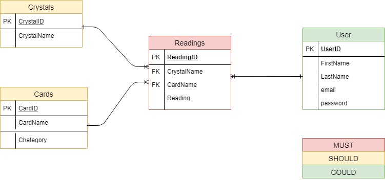

# QAProject2: Tarot Readings with the help of crystals!

Resources:

-  Presentation:
    
-  Asana: https://app.asana.com/0/1155050189853508/board
    
-  Website:  34.89.115.195

# The brief

The requirements of the project are as follows:

 - An Asana board (or equivalent Kanban board tech) with full expansion 
   on tasks needed to complete the project. This must also provide a   
   record of any issues or risks that you faced creating your project.  
  - An Application fully integrated into a Version Control System which  
   will subsequently be built through a CI server and deployed to a   
   cloud-based virtual machine. If a change is made to a code base, then
   Web hooks should be used so that Jenkins recreates and redeploys the 
   changed application 
  - The project must follow the service-oriented architecture that has been asked for. 
  - The project must be deployed  using containerisation. 
   - As part of the project you need to create an Ansible Playbook that will provision the environment that your application needs to run.

# My approach 
I created an app which randomly choose a crystal from a list and a randomly choose a card from the Tarrot Deck. Therefore, depenting on the crystal you get the the meaning of the card or the reverse meaning of the card.

# Microservise Architecture

# Planing
The planning of this project happent through Asana 
import pic 

# User Stories
|No|User Story  |
|--|--|
| 1 | As a user,I want to feel like the system knows some personal info so I can feel like it gives me an accureate results |
| 2|As a user i want to know that my personal information is not being used for anything else so I can feel safe to use the system  |
| 3 | As a user I want to know which crystal is the appropriete to use for each reading so i  know the reading i get is correct |
| 5| As a user i want to be able to know which card i have so i can understand the reading |

# EDR

# Risk Assesment

# Deployment

# Future Updates

 - Add all 78 cards of the tarrot deck (currently only 22 cards)
 - Debug Jenkins
 - Automate testing
 - Create all the tables of the EDR

# References
The meaninig of each card can be found: 
[https://python-tarot.herokuapp.com/](https://python-tarot.herokuapp.com/)
